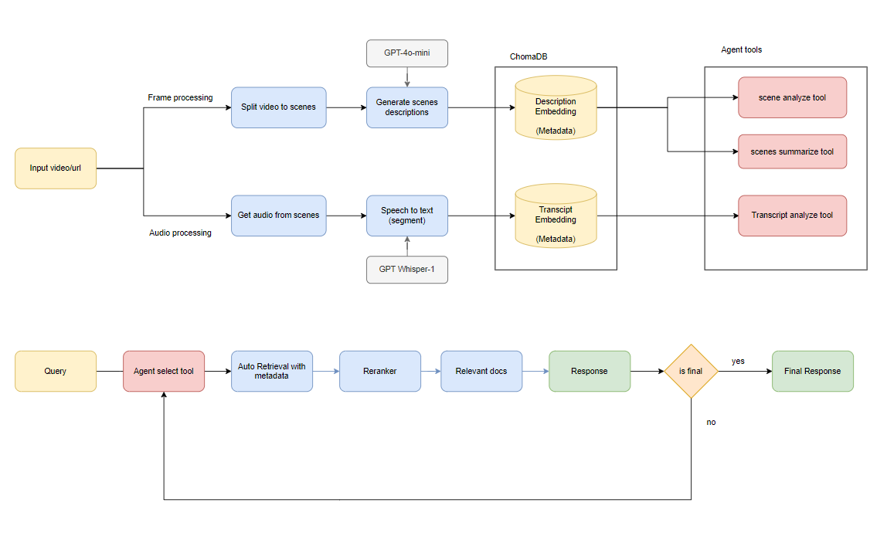
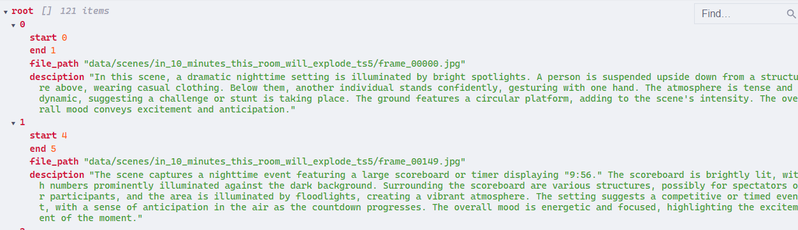
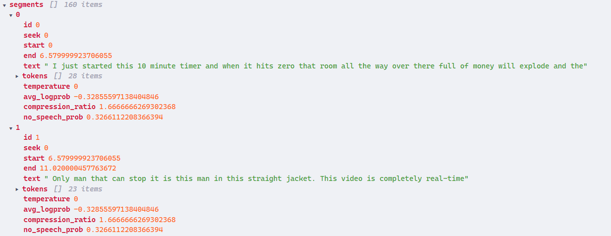
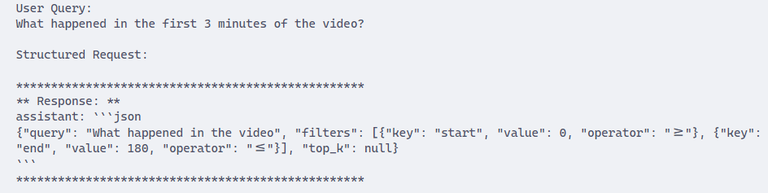
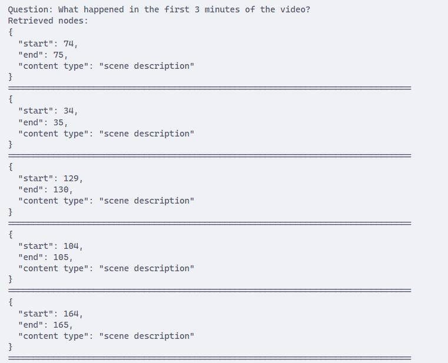
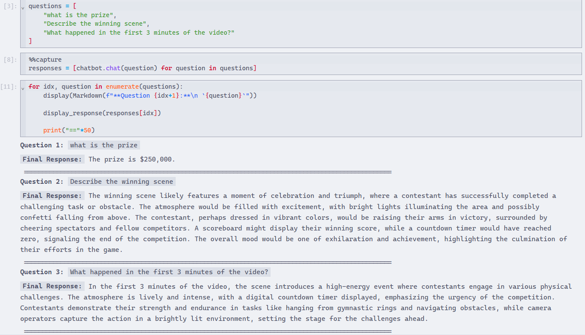
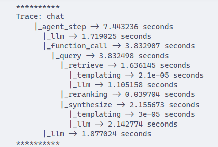
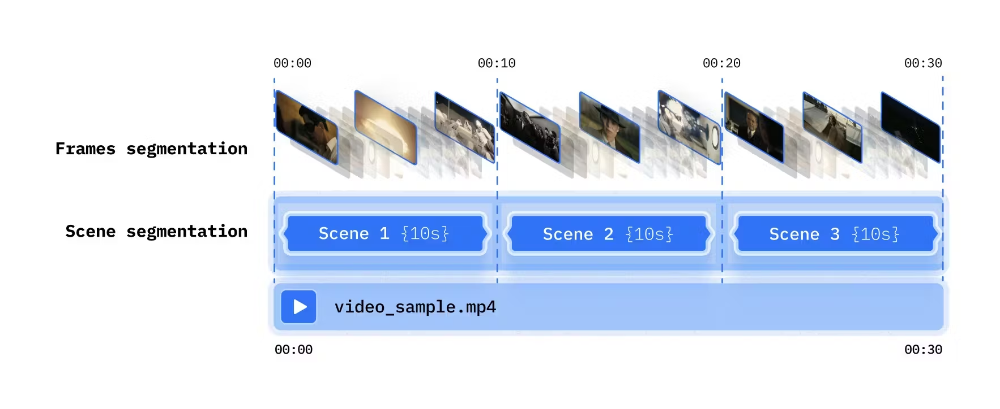
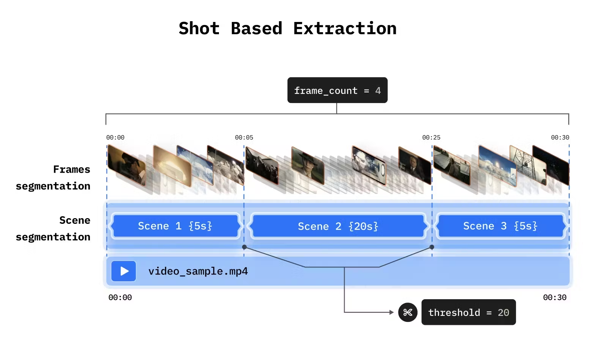

# Video Analyst chatbot

### 1. Proposed pipeline

### 2. Results
**Demo Video**:
[Demo Video](https://drive.google.com/file/d/1-lJYnsVc1GFi7-Y7FSxLIJR597EpE9_z/view?usp=drive_link)

**Test video:** [https://www.youtube.com/watch?v=Pv0iVoSZzN8&vl](https://www.youtube.com/watch?v=Pv0iVoSZzN8&vl=en)

**Sample scene description:**

**Sample audio transcript:**

**Retrieval with metadata (t_start, t_end of an event):**

- The model au to generate filter base on query

- Retrieved node have metadata followed the filter

**Demo chatbot with 3 questions** (File `notebooks/demo_chatbot_simple.ipynb`)

**Debugging and tracing** (File `notebooks/demo_chatbot_logging.ipynb`)

**Compare rag technique used in this pipeline:** File `notebooks/rag_develop_pipelines.ipynb`

### 3. Further Improvement

**Better video splitting strategy:**

- Time based extraction

- Shot based extraction

**Better audio transcript segment strategy:** 

- Default transcript segmented by Whisper model may lead to bad retrieval results
- Combine word level, segment level to improve keyword search

**Enhance metadata search**

- Currently metadata only contain time start and time end of an event
- Apply more techniques to extract more information from video scenes and store in metadata: person detection, face detection, …